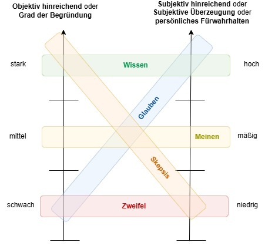

## Glauben, Meinen und Wissen

Kant spricht von Glauben, Wissen und Meinen in der "Kritik der reinen Vernunft", und zwar im Abschnitt über den Modus des Fürwahrhaltens. Genauer ist das Thema im ersten Teil der Transzendentalen Methodenlehre unter der Überschrift:

"Vom Unterschied des Meinen, Wissens und Glaubens"
Die genaue Stelle befindet sich in der B-Ausgabe der Kritik der reinen Vernunft (1787), B 848–B 857 (entspricht den Seiten 848 bis 857 in der paginierten Akademie-Ausgabe). Dort geht Kant auf die Unterschiede zwischen diesen drei Formen des Fürwahrhaltens ein:

**Meinen:** Ein subjektiv hinreichendes, aber objektiv unzureichendes Fürwahrhalten.
**Wissen:** Ein sowohl subjektiv als auch objektiv hinreichendes Fürwahrhalten, das Beweise und Gewissheit verlangt.
**Glauben:** Ein subjektiv hinreichendes Fürwahrhalten, das jedoch objektiv unzureichend ist.
Kontext:
Kant unterscheidet in diesem Abschnitt zwischen der subjektiven Überzeugung, die für eine Person gilt, und der objektiven Gültigkeit (Grad der Begründung), die überpersönlich und allgemein nachvollziehbar sein muss.

Kant unterscheidet in seinem Begriffssystem zwischen **subjektiv hinreichend** und **objektiv hinreichend**, um den Unterschied zwischen persönlichen Überzeugungen und allgemein gültigem Wissen zu erklären. Hier sind die beiden Begriffe im Detail:

---

### **Subjektiv hinreichend:**
- **Definition:** Eine Überzeugung ist **subjektiv hinreichend**, wenn sie für die jeweilige Person überzeugend ist. Das bedeutet, dass sie die inneren Maßstäbe der Person erfüllt und diese für sich selbst davon überzeugt ist, dass die Aussage wahr ist.
- **Merkmale:**
  - Die Überzeugung basiert auf persönlichen Gefühlen, Überlegungen oder Erfahrungen.
  - Sie erfordert keine allgemein akzeptierte oder nachvollziehbare Grundlage.
  - Sie gilt nur für das Individuum und ist nicht notwendigerweise rational begründet oder beweisbar.
- **Beispiel:** Jemand glaubt aus persönlicher Erfahrung, dass eine bestimmte Heilpflanze bei einer Krankheit hilft, ohne dass es wissenschaftliche Belege dafür gibt. Subjektiv ist das für diese Person hinreichend.

---

### **Objektiv hinreichend:**
- **Definition:** Eine Überzeugung ist **objektiv hinreichend**, wenn sie durch allgemein gültige und nachvollziehbare Gründe oder Beweise gestützt wird. Das bedeutet, dass die Überzeugung nicht nur für den Einzelnen, sondern auch für andere Menschen, die dieselben Gründe prüfen, überzeugend ist.
- **Merkmale:**
  - Die Überzeugung basiert auf logischen Argumenten, empirischen Beweisen oder allgemein anerkannten Prinzipien.
  - Sie ist unabhängig von den Gefühlen oder Meinungen des Einzelnen.
  - Sie erfüllt die Anforderungen an allgemeine Nachprüfbarkeit und Rationalität.
- **Beispiel:** Wissenschaftliche Erkenntnisse, die durch Experimente und Beweise gestützt werden, wie die Schwerkraft, sind objektiv hinreichend. Sie überzeugen nicht nur Einzelne, sondern auch andere, die dieselben Beweise prüfen.

---

### Der Unterschied:
- **Subjektiv hinreichend** reicht aus, um eine persönliche Überzeugung zu stützen, hat aber keine zwingende Gültigkeit für andere. Es ist eher individuell und emotional.
- **Objektiv hinreichend** hat universelle Gültigkeit und stützt sich auf Beweise oder Prinzipien, die unabhängig von individuellen Überzeugungen sind. Es ist rational und allgemein nachvollziehbar.

---

### Verbindung zu Wissen, Meinen und Glauben:
- **Meinen:** Subjektiv hinreichend, aber nicht objektiv hinreichend.
- **Glauben:** Subjektiv hinreichend, objektiv aber unzureichend, oft in moralischen oder religiösen Kontexten.
- **Wissen:** Sowohl subjektiv als auch objektiv hinreichend, da es auf Beweisen und innerer Überzeugung beruht.