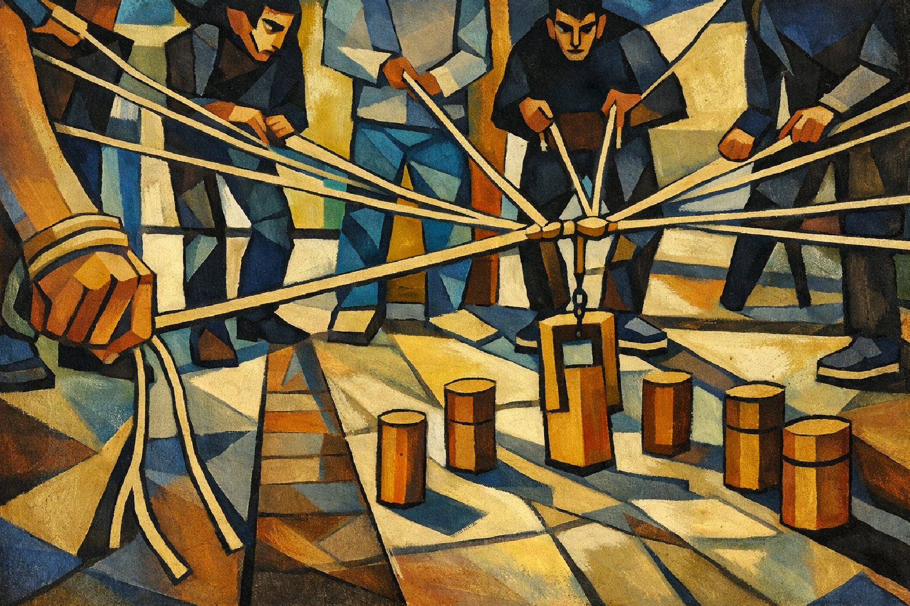

# Summary: The Effective Executive by Peter F. Drucker

## 1. Effectiveness Can Be Learned

### 1.2 Effectiveness Over Brilliance

There is little correlation between a man's effectiveness and his intelligence, his imagination, his knowledge of his business, or his education. 
Brilliant men are often strikingly ineffective.
**The fail to realize that the brilliant insight is not by itself achievement.** They have never learned that insight become effectiveness only through hard systematic work.

Many people rush around in the frenzy and busyness (bright people confuse that often with creativity). The workhorse, on the other hand sets step after step and gets there first, like the tortoise in the fable.

> *The Fable of the Tortoise and the Hare*
> In the fable, the hare(rabbit) is so confident in his speed that he takes a > nap during the race, while the tortoise, though slow, keeps moving forward steadily and ultimately wins. This story illustrates that consistent, focused effort often leads to success more than raw talent or intelligence.

Intelligence, imagination, and knowledge are essential resources. Nevertheless only effectiveness is the goal to get results out of these resources.
In the end, effectiveness is a habit, a discipline, and a skill. It can be learned.

#### Knowledge Workers doing

One can indeed never be sure what the knowledge workers thinks -- and yet **thinking is his specific work; it is his "doing"**.

### 1.2 Effectiveness is working on the right things

Working on the right things is what makes knowledge work effective. This is not capable of being measured by any of the yardsticks for manual work.

Education is the one area which when provided can make the knowledge worker productive. 
 **Productivity for the knowledge worker means the ability to get the right things done. It means *effectiveness*.**

Knowledge work is not defined by its quantity, neither by its costs. 
**Knowledge work is defined by its results!**

### 1.3 Executive Realities - What is pushing towards ineffectiveness

1. the Executive's time tends to belong to everybody else
2. Executives are forced to keep on "operating" unless they take positive actions to change the reality in which they live and work. 
  e.g. people tend to continue to work in the old position (e.g. marketing) although they have been promoted to an executive position and are in charge of e.g. the whole business and should work in this direction.
  If an executive let's the flow of events determine what he does and what he takes seriously, he will waste himself in "operating". He wastes his knowledge and abilites and throws away the little time he needs for effectiveness.
  He needs criteria for him to decide what is really important. That is on contributions and results, even if those criteria is not found in the flow of events.
3. Executives are within an organization (1) - **use what others are producing and vice versa** 
  He is only effective when other people use what he contributes. Organizations are good if the multiply the strength of individuals. Knowledge workers are rarely in phase with each other. So each has to be able to use what others produces.
  Unless the executive can reach these people, can make his contribution effective for them and in their work, he has no effectiveness at all.
4. Executives are within an organization - **gain access to the outside** (2)
  The executive sees the outside only through thick and distorting lenses, if at all. What goes on outside is usually not even known firsthand.
  But all the results are outside, there are no results inside the organization.
  Unless he makes special efforts to gain access to the outside, he will be increasingly inside focused. The higher up in the organization he goes, the more the more he will be drawn to problems and challenges of the inside rather to events on the outside. The thing with relevant outside events is that they are rarely available in quantifiable form until it is much to late to do anything about them.  
  **Truly important events on the outside are not the trends.** ***Truly important events are changes in the trends*** .   e.g. PC → Mobile Phones, Office → remote Work, On-Premise → Cloud.
  Such changes, however, have to be perceived. The cannot be counted, defined, of classified. They have to be sensed, felt, and interpreted. Man, while is not particularly logical is perceptive — and that is his strength. He can see he relevant outside events which rarely are available in quantifiable form. The relevant outside events are often qualitative and not capable of quantification.
  Furthermore, the tremendous amount of computer information may thus shut out access to reality.

### 1.4 The Promise of Effectiveness

A senior executive should have extraordinary abilities. He should excel as an analyst, decision maker, communicator, leader etc.
What seems to be wanted is **universal genius**, but this is a rare supply. The experience of the human race indicates strongly that the only person in numerous supply is the **universal incompetent**.
Therefore you have to staff your organizations with people who at best perform in one of the abilities with excellence.
So we have to learn to make the best use of people who are good at one area.
if you can't increase the suppy of a resource, you have to increase its yield (Ertrag).
Effectiveness is **the one tool** to make the resources of ability and knowledge yield more and better results.

### 1.5 But can effectiveness be learned?

If effectiveness can be learned then:
1. What does it consist in?
2. What does one have to learn?
3. Of what kind is that learning?
4. Is it a skill which one learns as an apprentice?
5. Is it a practice which one learns by doing the same things over and over again?

Drucker soon learned through observation that there is no effective personality.
Effective executives differ widely in their temperaments and their abilities, in what they do and how they do it, in their personalities, their knowledge, their interests –– in fact in almost everything that distinguishes one human being from another.

**All they have in common is the ability to get the right things done.**
What all these effective executives have in common is the ***practices*** that make effective whatever they have and whathever they are. And those practices are the same wherever the excecutive operates.
Nevertheless whenever Drucker found a man, no matter how great his intelligence, his imagination, his knowledge,etc., who did not use those practices he lacked in effectiveness.

Effectiveness, in other word is a **habit**, which is a set of **practices**.
And practices always can be learned. Practices are simple, *deceptively(trügerisch) simple*. A seven year old has no problems in understanding them.
But practices are always *exceedingly hard to do well*. The have to be acquired, as well as we all learn the multiplication table, that is repeated ad nauseam until it becomes a unthinking, conditioned reflex, and firmly ingrained habit. 
**Practices one learns by practicing and practicing and practicing again.**

If you learn Piano you probably won't be able to play Mozart like Arthur Schnabel did, but there is no reason in the world why you should not be able to play the scales like Schnabel did.
In other words there is no reason why anyone in the world should not be able to acquire competence in any practice. Mastery might well elude him; for this one might need special talent. 
But what is needed in effectiveness is competence, not mastery. What is needed are "the scales"!

There are essentially five practices, five such habits of the mind that have to be acquired to become an effective executive.

1. **Effective Executives know where their time goes**. 
They work systematically at managing the little of their time that can be brought under their control. 
2. **Effective Executives focus on outward contribution**.  They streamline there efforts to results, rather than to work. The start with the question "What results are expected of me?" rather than with the work to be done or the techniques to be applied.
3. **Effective Executives build on their strengths**.  Their own strengths, the strengths of their superiors, colleagues, subordinates, an on the strenght is the situation, that is, on what they can do. They do not build on weaknesses. They don't start out with the things they cannot do.
4. **Effective Executives concentrate on a few major areas where superior performance will produce outstanding results.**  They force themselves on the few major areals where superior performance will produce outstanding results. The force themselves to set priorities and stay with those priority decisions. They know that they have no choice but to do first things first––and second things not at all. **The alternative is to get nothing done.**
5. **Effective Executives make effective decisions.**  They know that this is, above all, a matter of system––of the right steps in the right sequence. They know that an effective decision is always a judgement based on "dissending(abweichend) opinions" rather than "consensus on the facts". And they know that to make many decisions fast means to make the wrong decisions. What is needed are few, but fundamental, decisions What is needed is the right strategy rather than razzle-dazzle tactics.

## 2. Know Your Time

Most people think you should plan your work. Unfortunately, the plans always remain on paper, always remain good intentions. The rarely become achievements. This becomes frustrating.

Effective Executive, do not start with their tasks! 
**The start with their time.**  
And they do not start out with planning. 
**They start by finding out where their time actually goes.** 
**Then they attempt to manage their time and to cut back unproductive demands on their time.** 
**Finally they consolidate their available time into the largest possible continuing chunks.** 

So it is a three step process:

1. Record your time
2. Manage your time
3. Consolidate (zusammenlegen) your time
This process is the foundation of effectiveness.

Effective executives know that **time is the limiting factor**. 
The output limits of any process are set by the scarcest resource. In knowledge work this is time. 
In the process we call "accomplishment," this is time. In other words, **Time is the fundamental resource that makes accomplishment possible.** 

**Time is an unique, outstanding resource** 
All of the other major resources, e.g. money is quite plentyful. We long ago should have learned that it is the demand for capital, rather than the supply which sets the limit to economic growth.
People –– the third limiting resource –– one can hire, though one can rarely hire enough good people.
→ **But one can not rent, hire, buy or otherwise obtain more time.** 
The supply of time is totally inelastic. No matter how high the demand, the supply will not go up.
Moreover, time is perishable (transient, vergänglich) and cannot be stored. 
**Yesterday's time is gone forever and will never come back.**  Time is therefore always in exceedingly short supply. It is always the scarcest resource.
All works take place in time and uses up time.
Yet most people take for granted this unique, irreplaceable, and necessary resource.
→ *Nothing else*, perhaps, distinguishes the effective executive as much as their tender loving care of time.  
**Man is ill-equiped to manage his time.** 

The effective executive therefore knows that to manage his time, he first has to know where it actually goes. 

### 2.1 Large Chunks of time instead of Time Wasters

in every executive job, a large part of the time must therefore be wasted on things which, though they apparently have to be done, contribute nothing or little.
The higher up in the organization hie is, the more demands on his time will the organization make. 

Yet most of the tasks of the executive require, for minimum effectiveness, a fairly large quantum of time. To spend in one stretch less than his minimum is sheer waste.
→ **One accomplishes nothing and has to begin all over again.** 

e.g. if you write a report it may require 6 to 8 hours at least to write a first draft. It is pointless to give seven hours to the task by spending fifteen minutes twice a day for three weeks. 
All you've got is a blank paper with some doodles on it. But if one can lock the door, disconnect from communication and sits down for let's say 5 to 6 hours without interruption, one has a good chance to write a what Drucker calls a "zero draft". The one before the first draft. From then you can work in fairly small installments, can rewrite, edit and correct section nby section, paragraph by paragraph, sentence by sentence.

So, to be effective you have to be able to dispose of time in fairly big chunks. To have small dribs of time at his disposal will not be sufficient even if the total is an impressive number of hours.
This is particularly true with respect to time spent working with people, which is of course, a central task in the work of the executive. People are time-consumers. And most people are time-wasters.
So, to get anything done with people and have an impact you have to spend a fairly large minimum quantum of time.
One has to sit down with a knowledge worker and think through with him what should be done an why, before one can even know whether he is doing a satisfactory job or not. And this is time consuming.

The knowledge worker must be focused on the results and performance goals of the entire organization to have any results and performance at all. So he has to set aside time to direct his vision from his work to results, and from his specialty **to the outside in which alone performance lies.**

So an superior has to sit down with his knowledge workers on a regular basis and ask:

- What should we at the head of the organization know about your work?
- What do you want to tell me regarding the organization?
- Where do you see opportunities we do not exploit?
- Where do you see dangers to which we are still blind?
- And all together, what do you wand to know from me about the organization?

Without it, the knowledge people either loose enthusiasm and become time-servers and get away from opportunities and needs of the organization. 
*Note: What came into my mind when reading that was a quote from Saint-Exupery: "If you want to build a ship, don’t drum up the men to gather wood, divide the work, and give orders. Instead, teach them to yearn (verlangen) for the vast and endless sea."*

Among the effective executives Drucker observed people who made decisions fast, and people who make them rather slowly.
But without exception **the make personnel decisions slowly** and they make them several times before they really commit themselves.
e.g. Sloan, former boss of General Motors never made a personnel decision the first time it cam up and he always picked winners.
Asked about his secret: "No secret–– I have simply accepted that the first name I come up with is likely to be the wrong name––and I therefore retrace the whole process of thought and analysis a few times before i act". Yet Sloan was far away from a patient man.

### 2.2 Time-Diagnosis

That one must record the time before one can know where it goes, and before one can try to manage it.

The specific method of recording time is not important to us. What matters is that it is done and that the recording takes place in "real-time", i.e. at the moment the event occurs and not later from memory.

Many people keep such a log continuously and review it regularly every month. At a minimum, they keep it for about three to four weeks at a stretch, about twice a year, on a regular schedule.

Time utilization improves with practice. 
  **But only ***constant*** efforts in time management can prevent one from drifting and wasting time on trivialities.**

#### 2.2.1 Systematic Time Management – Find the Time Thieves - Time Diagnosis

One has to find the nonproductive, time-wasting activities and get rid of them if one possibly can.

1. Try to identify and eliminate the things that need not be done at all. Those are purely a waste of time without any results.
Look at the time record and ask for every activity: **What would happen if this were not done at all?** If the answer is "Nothing would had happen", then obviously the conclusion is to stop doing it.
2. Delegation: **"Which of the activities on my time log could be done by somebody else just as well, if ot better?"**
There is a lot of work which easily can be done be down by others and therefore should be done by others.
"Delegation" as the term is customarily used, is a misunderstanding––is indeed misdirection. But getting rid of anything that can be done by somebody else so that one does not have to delegate but can really get to one's own work––that is major improvement in effectivess.
3. The Time of Others he himself wastes
Ask others, "What do I do that wastes your time without contributing to you effectiveness?"
The manner in which an executive does productive work may still be a major waste of somebody's else' time.

Possibility of an invitation to a meeting:
"I have asked [Messrs Smith, Jones, and Robinson] to meet with me [Wednesday at 10 A.M.] to discuss [next years capital appropriations budget]. Please come if you think that you need the information or want to take part in the discussion. But you will in any event receive right away a full summary of the discussion and of any decisions reached, together with a request of your comments"
--> where formerly a dozen people came and stayed all afternoon, three men and a secretary to take the notes now get the matter over with within an hour or so. A no one feels left out.

#### 2.2.2 Cut the Time Wasters

1. **Recurrent Crisis** - The first task is to identify the time wasters which follow from lack of system or foresight. 
The symptom to look for is the "recurrent crisis", the crisis which comes back year after year. A crisis that recurs a second time is a crisis that must not occur again.
A recurrent crisis should always have been foreseen. It can therefore always be prevented or reduced to a routine which clerks can manage.
A recurrent crisis is simply a symptom of slovenliness (Schlampigkeit) and laziness.
e.g. a well-managed plant, is a quiet place. A "factory" that is "dramatic", a factory in which the "epic of the industry" is unfolded before the visitors eyes, is poorly managed.
Nothing exciting happens in it because the crises have been anticipated and have been converted into routine.

2. Time-wastes often results from **overstaffing** 
A work force may, indeed, be too small for the task. And the work suffers, if it gets done at all. But this is not the rule. Much more common is the work force that is too big for effectiveness, the work force that spends, therefore, an increasing amount of its time "interacting" rather than working. If an big fraction of time time is used for "problems of human relations", on feuds and frictions, on jurisdictional disputes and questions of cooperation, and so on, then the work force is almost certainly too large. People get into each others ways.

3. **Malorganization** - Excess of Meetings  It's symptoms is an excess of meetings. There will always be more than enough meetings.
But if a executives spend more than a fairly small part of their time in meetings, it is sure sign of malorganization.
Every meeting generates a bunch of little follow up meetings – some formal, some informal, but both stretching out for hours.
An undirected meeting is not just a nuisance; it is danger.
Meetings have to be the exception rather than the rule (Kontroverse zu Scrum????)
Exceptions are special organs whose purpose is to meet, e.g. the board of directors.

4. **Malfunction in information** In many organizations, time is not lost because of a lack of work, but because of poor information — it arrives too late, is incomplete, or is presented in the wrong form. Effective communication and proper information structures are therefore essential for efficient work. (e.g. information does not get to the places where it is needed, is not prepared in a way people need it, e.g. averages).

#### 2.2.3 Consolidating "Discretionary Time"

The one who records and analyzes his time and then attempts to manage it can determine how much he has for his important tasks.

How much time is there that is "discretionary", that is the time which is available for the big tasks that will really make a **contribution**.

A manager of a big bank always made his meeetings for 1,5h. 

- Asked why, he answered "because i have found out that my attention span is about an hour and a half. If i work on any topic longer that that, i start to repeat myself. At the same time, I have realized that nothing of importance can really be tackled in much less time. One does not get to the point where one understands what one is talking about.
- And furthermore he said: "My secretary has strict instructions not to put anyone through except the President of the United states and his wife.
- Later on he has half an hour to return every call and read every message. Anmerkung: Er braucht auch Pausen.

Senior Executives rarely have as much as one quarter of their time truly at their disposal and available for the important matters, they are being paid for.

- You have to consolidate discretionary time.
- You know that you need large chunks of time ant that small driblets are no time at all.
- One quarter of the working day, is usually enough to get important things done.
- But even three quarters of the working day are useless if they are only available as fifteen hours here or half an hour there.

The final step in time management is therefore to consolidate the time that is available visible through record and analysis and under the executive's control.

*Note: Why working at home nights is so popular is actually its worst feature: It enables you to avoid tackling your time and its management during the day.*

Another approach of most people is trying to push the secondary, the less productive matters together, this clearing, so to speak, a free space between them. This does not lead very far, however. One still gives priority in one's mind and in one's schedule to the less important things, the things that have to be done even tough they contribute little.

Effective one start out by estimating how much discretionary time they can realistically call their own. Then the set aside continuous time in the appropriate amount. And if the find later that other matters come up on this reserve they scrutinize(prüfen) their record again and get rid of some more time demands from less than fully productive activities. You rarely cut away enough of your time thieves.

All effective ones control their time management perpetually. The not only keep a continuous log and analyze it periodically. The set themselves deadlines for the important activities, based on their judgement of their discretionary time.

*Note: A highly effective man Drucker knows keeps 2 Lists – one of the **urgent** and one of the **unpleasant** things that have to be done – each with a deadline. When he finds his deadlines slipping, he knows his time is again getting away from him. Anmerkung von mir: Es wird immer wieder passieren und nur mit der Zeit und Disziplin besser*

Time is the scarcest resource, and unless it is managed, nothing else can be managed. The analysis of one's time, moreover, is the one easily accessible and yet systematic way to analyze one's work and to think through what really matters in it.

"Know Thyself" the old prescription for wisdom, is almost impossibly difficult for mortal men.
But everyone can follow the injunction **"Know Thy Time"** if he wants to, and be well on the road to contribution and effectiveness.

## 3. What Can I Contribute

The focus on contribution is the key to effectiveness; in a man's own work — its content, its level, its standards, and its impacts; in his relations with others — his superiors, his associates, his subordinates; in his use of the tools of the executive such as meetings and reports.

Don't be occupied with efforts, be occupied with results.

The man who focuses on efforts and who stresses his downward authority is a subordinate no matter how exalted his title and rank. **But the man who focuses on contribution and who takes responsibility for results, no matter how junior, is in the most literal sense of the phrase, "top management." He holds himself accountable for the performance of the whole.**

### 3.1 The Executive's own Commitment

The focus on contribution turns the attention away from his own speciality, his narrow skills, his own department, and toward the performance of the whole. **It turns his attention to the outside, the only place where there are results.**  
He will think in terms of the customer, the client or the patient.  
*As a result, what he does and how he does it will be materially different.*  

To ask, "What can I contribute?" is to look for the unused potential in the job. And what is considered excellent performance in a good  many positions is often but a pale shadow of the job's full potential of contribution.  
Every organization needs performance in three major areas:

- it needs direct results
- it needs building of values and their reaffirmation
- it needs building and developing people for tomorrow

If deprived of performance in any of these areas it will decay and die.

The most common cause of executive failure is the inability or unwillingness to change with the demands of a new position. The executive who keeps on doing what he has done successfully before he moved is almost bound to fail. 
Better think what do i have to do that makes a real difference for the company, a real significant contribution.

### 3.2 How To Make The Specialist Effective

The task is to enable specialists to male himself and his specialty effective. This means that he must think through who is to use his output and what the user needs to know and to understand to be able to make productive the fragment the specialist produces.

Ask others:

- What contribution from me do you require to make your contribution to the organization?
- When do you need this, how do you need it, and in what form?

The only meaningful definition of a "generalist" is a specialist who can relate his own small area to the universe of knowledge. MAybe a few people have knowledge in more than a few small areas. But that does not make the generalists; it makes them specialists in several areas.
A specialist has to learn enough of the needs, the directions, the limitations, and the perceptions of others to enable them to use his own work.

### 3.3 The Right Human Relations

Executives don't have good human relations because they have a "talent for people", they have good relations because they focus on contribution in their own work and in their relationships with others. As a result, their relationships are productive-and this is the only valid definition of good "good human relations. Warm feelings and pleasant words, are indeed a false front for wretched attitudes, if there is no achievement in what is, after all, a work focused and task focused relationship. on the other hand, an occasional rough word will not disturb a relationship that produces results and accomplishments for all concerned.

the focus in contribution by itself supplies the for basic requirements of effective human relations:

- communications
- teamwork
- self development
- and development of others

#### 3.3.1 Communications

Communications downward from management to the employee, from the superior to the subordinate are practically impossible if they are based on a downward relationship.
The harder das superior ist trying to say something to his subordinate, the more likely is it that that the subordinate will mishear. He will rather hear what he expects to hear rather than what is being said.

Executives who take responsibility for contribution in their own work will, as a rule, demand that their subordinates take responsibility too. They will tend to ask their men: *What are the contributions for which this organization and I, your superior, should hold you accountable? What should we expect of you? What is the best utilization of your knowledge and your ability?* And then communication becomes possible, becomes indeed easy.
Once the subordinate has thought through what contributions should be expected of him, the superior has, of course, both the right and the responsibility to judge the validity of the proposed contribution.

#### 3.3.2 Focus on contribution leads to sideways communications

The question *"Who has to use my output for it to become effective?"* immediately highlights the importance of those not in the direct line of authority. It underlines that in a knowledge organization, effective work is done by diverse teams who collaborate voluntarily based on the task's demands, rather than on formal hierarchies.

In knowledge work, communication is becoming crucial due to the computer revolution in information. Historically, the challenge was to transmit information without it being distorted by human opinions or biases. Now that information is often impersonal and "pure," we must deliberately create opportunities for genuine communication—through spoken or written word—to understand each other's needs, goals, and perspectives. The more we automate information handling, the more we must ensure real communication happens.

#### 3.3.3 Individual self-developments depends on the focus on contributions

The man who asks of himself, *"What is the most important contribution I can make to the performance of this organization?"* is in effect asking:

- What self-development do I need?  
- What knowledge and skill do I have to acquire to make the contribution I should be making?  
- What strengths do I have to put to work?  
- What standards do I have to set myself?

#### 3.3.4 The one who focuses on contribution stimulates others to develop themselves

We know very little about self-development, but we do know one thing: people in general, and knowledge workers in particular, grow according to the demands they make on themselves. They grow according to what they consider to be achievement and attainment. If they demand little of themselves, they will remain stunted. If they demand a good deal of themselves, they will grow to giant stature—without any more effort than is expected by the non-achiever.

### The Effective Meeting

Effective executives know what they expect to gain from a meeting, report, or presentation, and they define the purpose clearly in advance. They ask: *Why are we having this meeting? Do we want a decision, to inform, or to clarify our direction?* They insist that the purpose be defined before any meeting is called, any report requested, or any presentation organized. In short, they ensure that each meeting directly serves a meaningful contribution.
One obvious but often overlooked rule is that you can either direct a meeting and listen for important points, or you can participate and speak—you cannot do both. But the cardinal rule is to focus it from the start on contribution.
Focusing on contribution helps executives cut through the confusion of events and identify what truly matters. By emphasizing relevance and turning the inherent dependence on others into a strength, it creates a team mindset. Ultimately, focusing on contribution shifts attention outward to organizational results and external needs, thus enhancing overall effectiveness.

## 4. Making Strength Productive

The executive makes strength productive. He knows that one cannot build on weakness. **To achieve results, one has to use all the available strengths**, the strengths of associates, the strengths of the superior, and one's own strengths. These strengths are the true opportunities. To make strength productive is the unique purpose of organization. It cannot, of course, overcome the weaknesses with which each of us is abundantly endowed, but it can make them irrelevant. Its task is to use the strength of each man as a building block for joint performance.

### 4.1 Staffing From Strength

Whoever tries to place a man or staff an organization to avoid weaknesses will end up at best with mediocrity. The idea that there are well-rounded people, people who have only strengths and no weaknesses—whether the term used is the whole man, the major personality, the well-adjusted personality, or the generalist—is a prescription for mediocrity, if not for incompetence. Strong people always have strong weaknesses too. Where there are peaks, there are valleys. And no one is strong in many areas. Measured against the universe of human knowledge, experience, and abilities, even the greatest genius would have to be rated a total failure. There is no such thing as a good man. "Good for what?" is the question.  
**Lack of weaknesses isn't strength. Avoiding weakness will bring you mediocrity.**

Effective executives never ask, "How does he get along with me?" The question is, "What does he contribute?" The question is never, "What can a man not do?" The question is always, "What can he do uncommonly well?" In staffing, they look for excellence in one major area and not for performance that just gets by all around.

Basically, people who truly excel in many different fields at once are incredibly rare. We often think of a "universal genius," but in reality, even the greats like Leonardo da Vinci or Goethe only truly stood out in one area despite having many interests. If we only remembered Goethe for his scientific work and not his poetry, he wouldn't be as renowned. And what’s true for these giants is true for the rest of us as well.

The very strong individuals don't really need an organization; they thrive on their own. Most of us, however, aren't that exceptionally strong, so we can't just rely on individual talent alone. As the saying goes, you can't hire just a hand—the whole person, with all their weaknesses, comes with it. Similarly, none of us can be only strong; weaknesses are always part of the package. The key is to structure the organization so that weaknesses become irrelevant and strengths are what really matter.

Insisting on impersonal, objective job roles is vital because it allows an organization to embrace a diversity of personalities and perspectives. By focusing on tasks and objective criteria, you avoid favoritism and ensure that decisions are made based on what is right rather than who is right. This structure helps maintain fairness and encourages the kind of diversity and dissent needed for good decision-making, rather than simply asking whether someone is likable. Without this approach, the organization risks losing its best people and stifling true progress.

Effective executives staff for strength by designing **doable, well-structured jobs**, not roles tailored to personalities. They redesign any job that repeatedly defeats capable people, recognizing that organizations exist to help ordinary people achieve extraordinary results.

They make jobs **big and demanding** so strengths can fully express themselves and adapt as conditions change—especially critical for young knowledge workers, whose first roles should test both their abilities and organizational fit.

Staffing decisions begin with **what a person can do**, not abstract job requirements. Performance, not “potential” or weakness-focused appraisals, is the only reliable measure. Effective appraisal focuses on past contributions, future strengths, learning needs, and character—integrity being the one non-negotiable requirement.

Executives accept that **strengths come with weaknesses** and tolerate irrelevant flaws while removing people who consistently fail to perform. They staff **opportunities, not problems**, reject the myth of the “indispensable man,” and always promote the best-qualified performer.

Ultimately, making strengths productive is not just a management technique but a **moral responsibility**. Organizations must serve individuals by enabling them to achieve through their strengths, which is essential in a complex, diverse, knowledge-based economy.

Effective executives staff for strength by first ensuring jobs are **humanly doable**. Any role that defeats several capable people must be redesigned, not filled with “genius.” Jobs should be **large and demanding**, allowing strengths to surface, adapt to change, and be tested—especially in early knowledge-work roles, where performance (not promise) is the only real measure.

Staffing starts with **what a person can do**, not with abstract job requirements. This requires a fundamentally different **appraisal procedure**, focused on strengths and performance rather than weaknesses or vague “potential.” Effective appraisals ask four questions:  
a. *What has the person done well?*  
b. *What is the person therefore likely to do well?*  
c. *What must the person learn to fully use their strengths?*  
d. *Would I want my son or daughter to work for this person—and why or why not?*  
Character and integrity are the one area where weakness is a true disqualification.

Effective executives accept that **strengths always come with weaknesses** and tolerate flaws that are irrelevant to performance. They reject the myth of the “indispensable man,” staff **opportunities rather than problems**, and remove consistently underperforming managers to protect both the organization and the individual.

The example of General Marshall illustrates these principles in action: he consistently asked *“What can this man do?”*, redeployed talent without sentimentality, and treated staffing as disciplined judgment rather than personal preference. Marshall understood—and teaches us—that **every people decision is a gamble**, but when it is based on proven strengths and performance, it becomes at least a **rational gamble**.

Ultimately, making strengths productive is not only a management necessity but a **moral obligation**. Organizations must enable individuals to achieve through their strengths in a complex, diverse, and knowledge-driven world.

### 4.2 How Do I Manage My Boss

Effective executives focus on making the **strengths of their superiors productive**, recognizing that their own success is closely tied to the effectiveness of their boss. This is not done through flattery or “managing up” politically, but by identifying what the superior does well and shaping one’s contribution so it can be used.

Instead of trying to reform a boss or compensate for weaknesses, effective executives ask:

- What can my boss do particularly well?
- What has he done well in the past?
- What does he need from me to perform effectively?

A critical part of this is adapting to **how the boss works**, not what is right or important. Superiors differ fundamentally in how they absorb information:

- **Readers** need written material before discussion; talking to them first is ineffective.
- **Listeners** grasp issues through spoken explanation; long reports are largely wasted on them.
- Some need brief summaries; others require detailed background.
- Some want early involvement; others only want fully developed proposals.

Understanding whether a boss is a reader or a listener—and structuring communication accordingly—is essential to making their strengths effective.

Ultimately, making the boss productive means **building on strengths and making weaknesses irrelevant**, focusing on presentation, timing, and format rather than substance. Few things contribute more to an executive’s own effectiveness than enabling the superior to perform at his best. :contentReference[oaicite:0]{index=0}

Yes. Drucker explicitly acknowledges a **third, much smaller group**, which can reasonably be called **“talkers.”** These are people who do not primarily process information by reading or listening, but by **talking it through**.

In his words, they *“get their information through talking, and by watching … the reactions of the people they talk to.”* They think while speaking, clarify ideas in dialogue, and often need immediate feedback to understand an issue fully. For them, meaning emerges **in the act of articulation**, not before it.
A listener absorbs a structured explanation. A talker needs interaction and often cannot fully grasp an idea until they verbalize it themselves.
Many talkers understand written material only after they speak it—either aloud or in discussion—because speech activates their thinking process.
Drucker notes that figures such as Franklin D. Roosevelt and Lyndon B. Johnson belonged to this category. Their effectiveness came from dialogue, probing questions, and real-time synthesis rather than documents.

**Practical implication:**
If your superior is a talker, neither long reports nor polished presentations will be sufficient on their own. What works is:

- short prompts or bullet points,
- meetings designed for dialogue,
- allowing them to restate, question, and reshape the idea verbally.

This fits Drucker’s larger point: effectiveness comes from adapting to **how people process information**, not from insisting on one “correct” mode of communication.

### 4.2.3 Making Strength Productive

Only strength produces results.

Effective executives focus on **making their own strengths productive** rather than dwelling on constraints, policies, or limitations. While they acknowledge limits, they refuse to use them as excuses and instead ask, *“What can I do?”*—which almost always reveals meaningful opportunities for action.

They understand **how they work best**: when they are most productive, whether they write, speak, negotiate, or decide well, and whether they function better alone, in teams, under pressure, or with time. These work habits—such as being a reader or listener—are not superficial but core sources of effectiveness. The effective executive accepts them and builds on them rather than trying to imitate others.

Effectiveness comes from **being oneself**, identifying recurring patterns of successful performance, and choosing roles and contributions that align with one’s temperament and strengths. Knowledge and talent matter, but temperament and work style are equally decisive.

This strength-based mindset is both a **practice and an attitude**. By consistently asking of others—and of oneself—*“What can this person do?”* executives learn to feed opportunities and starve problems. Weaknesses produce little beyond friction; only strengths produce results.

Leaders set the standard for performance. High-performing leaders raise the performance of everyone else, just as breakthroughs in sports raise expectations for all competitors. Therefore, executives place their strongest people in **standard-setting roles**, focusing on one decisive strength and treating weaknesses as irrelevant unless they block performance.

Ultimately, the executive’s task is not to change people, but to **multiply performance** by putting existing strengths, aspirations, and capabilities to work.

Unlike everything else discussed in this book so far, making strength productive is as much an attitude as it is a practice. But it can be improved with practice. If one disciplines oneself to ask about one’s associates—subordinates as well as superiors—“What can this man do?” rather than “What can he not do?” one soon
will acquire the attitude of looking for strength and of using strength. Andeventually one will learn to ask this question of oneself.

In every area of effectiveness within an organization, one **feeds the opportunities and starves the problems.** Nowhere is this more important than in respect to people. The effective executive looks upon people including himself as an opportunity. He knows that only strength produces results. Weakness only produces headaches—and the absence of weakness produces nothing. He knows, moreover, that the standard of any human group is set by the performance of the leaders. And he, therefore, never allows leadership performance to be based on anything but true strength.

## 5. First Things First

If there is any one **"secret"** of effectiveness, it is concentration. Effective executives **do first things first** and they do **one thing at a time**.

There are always more important contributions to be made than there is time available to make them. No matter how well an executive manages his time, the greater part of it will still not be his own. Therefore there is always a time deficit.

Yet to get even that half-day or those two weeks of really productive time requires self-discipline an an iron determination to say "No".

> Anmerkung zu „Nein“ und Freiheit
> 
> Drucker argumentiert **nicht psychologisch**, sondern **systemisch**.
> 
> Mit „self-discipline“ und „iron determination“ meint er **keine dauerhafte Selbstüberwindung** oder moralische > Härte. Das wäre für ihn ineffizient.
> Gemeint ist die Fähigkeit, **punktuell und konsequent „Nein“ zu sagen**.
> 
> 
> Dieses „Nein“ richtet sich **nicht nach innen**, sondern nach außen:
> 
> * gegen Unterbrechungen
> * gegen fremde Prioritäten
> * gegen den automatischen Zugriff anderer auf die eigene Zeit
> 
> Der Hintergrund ist **strukturelle Unfreiheit**:
> Ohne aktives „Nein“ wird Zeit standardmäßig von außen verbraucht.
> Produktive Zeit entsteht nicht von selbst, sie ist **kein Normalzustand**, sondern muss geschützt werden.
> 
> In diesem Sinne bedeutet Freiheit bei Drucker:
> 
> > **Verfügungsgewalt über die eigene Zeitstruktur**,
> > nicht über Gefühle oder Motivation, sondern über Zugriffspunkte.
> 
> Die „iron determination“ ist nötig, weil:
> 
> * die Umwelt permanent unterbricht,
> * Organisationen Fokus nicht respektieren,
> * Unterbrechung der Default ist.
> 
> Das „Nein“ ist daher **selten, hart, aber gezielt** –
> bewusste Aktivität, um Struktur zu schaffen.
> 
> Der Kern:
> 
> > Freiheit heißt bei Drucker nicht „tun, was man will“,
> > sondern **seine Zeit so zu organisieren, dass das Wesentliche überhaupt möglich wird**.
> 
> Oder zugespitzt:
> 
> > Wer nicht „Nein“ sagen kann, ist zeitlich unfrei –
> > unabhängig von Motivation oder Disziplin.
> 
> Selbstdisziplin ist bei Drucker **kein Dauerzustand**,
> sondern ein **Werkzeug zur Grenzziehung**,
> damit danach **ohne Disziplin** gearbeitet werden kann.
> 
> Das ist **strukturelle Freiheit**, nicht heroische Willenskraft.

Concetration is dictated so that most of us find it hard to do even one thing at a time. Some work best, doing two things in paralell, thus prviding a change of pace. This presupposes however hat they give each task the minimum quantum needed to get any results. 
The more one can concentrate rime, effort, and resources, the greater the number and diversity of tasks one can actually perform.

The "secret" of those people "who do so may things" and apparently so many difficult things is that they do **only one thing at a time". As a result, they need much less time in the end than the rest of us.

**Why Ineffective Executives Work Hard but Achieve Little?**

- 1. **Systematic Underestimation of Time** 
They underestimate the time for one task. They alway expect that everything will gor right but nothing ever goes right. The unexpected is actually the only one you can expect. And it is rarely pleasant. So set a fair margin for that
- 2. Hurrying Creates Delay
Hurrying puts the ineffective executive further behind because it **creates more work (errors and rework), destroys focus (constant switching prevents deep progress), eliminates buffers (no margin for the inevitable unexpected), and prevents completion (many tasks in motion, none finished)**; **a steady pace works because it reduces errors, preserves uninterrupted time, maintains slack (Puffer) for surprises, and allows tasks to reach completion before attention moves on.**
- 3. Multitasking Undermines Execution
Trying to do several things at once prevents any task from receiving sufficient uninterrupted time.  
As a result, no task reaches completion efficiently, and if one task encounters problems, the entire schedule collapses.  
Effective executives recognize the need for a minimum time “quantum” for each task.

***Effective executives know that they have to get many things done—and done
effectively. Therefore, they concentrate—their own time and energy as well as
that of their organization—on doing one thing at a time, and on doing first things
first.***

### 5.1 Sloughing Off Yesterday

The first rule for concentrating executive effort is to slough off the past that has ceased to be productive. Effective executives periodically review their own work programs—and those of their associates—and ask:

> “If we were not already doing this, would we go into it now?”

Unless the answer is an unconditional “Yes,” they drop the activity or sharply curtail it. At a minimum, they make sure that no further resources are invested in the no-longer-productive past. Crucially, first-class resources—especially the scarce resources of capable people—are immediately withdrawn from yesterday’s tasks and reassigned to the opportunities of tomorrow.

**Yesterday’s actions and decisions, no matter how courageous or wise they may once have been, inevitably become today’s problems, crises, and foolishness.** Yet it is the executive’s specific responsibility—whether in business, government, or any other institution—to commit today’s resources to the future. This necessarily means that every executive must spend a substantial part of his time, energy, and ingenuity patching up or bailing out decisions of the past, whether his own or those of his predecessors. In fact, this consumes more of his working time than any other single task.

An effective executive therefore systematically polices all programs, activities, and tasks. He continuously asks: “Is this still worth doing?” If it is not, he eliminates it in order to concentrate on the few tasks that, if done with excellence, will make a real difference to results. Above all, the effective executive sloughs off an old activity before starting a new one. This discipline is essential for organizational “weight control.” Without it, an organization quickly loses shape, cohesion, and manageability; social organizations, like biological organisms, must remain lean and muscular.

Getting rid of total failures presents little difficulty—they liquidate themselves. Far more dangerous are yesterday’s successes, which tend to persist long after their productive life has ended. Even more damaging are activities that should succeed but do not. These easily become “investments in managerial ego” and are treated as sacred. Unless they are pruned—and pruned ruthlessly—they drain the lifeblood of the organization. It is invariably the most capable people who are wasted in the futile attempt to give such ego-investments the success they are thought to deserve.

### 5.2 Priorities and Posteriorities

There are always more productive tasks for tomorrow that there is time to do them and more opportunities than there are capable people to take care of them—not to mention the always abundant problems and crises.
A decision therefore has to be amde as to which tasks deserve priority and which are of less importance.
**The only question is which will make the decision—you or the pressures?**
Somehow the tasks will be adjusted to the available time and the opportunities will become available only to the extent to which capable people are around to take charge of them.

If the pressures rather than the executive are allowed to make the decision,
the important tasks will predictably be sacrificed. Typically, there will then be
no time for the most time-consuming part of any task, the conversion of decision
into action. No task is completed until it has become part of organizational
action and behavior. This almost always means that no task is completed unless
other people have taken it on as their own, have accepted new ways of doing old
things or the necessity for doing something new, and have otherwise made the
executive’s “completed” project their own daily routine.

Another predictable result of leaving control to of priorities to pressure is that the work of top management does not get done at all. That is always postponable work, for it does not try to solve yesterday's crises but to make a different tomorrow. And the pressure always favor yesterday.
The pressures always favors always what happened over the opportunity.

The job is, **not to set priorities**, that is easy, everbody can do it.

This statement does not mean that executives should not set priorities. On the contrary, priorities must always be set. What it means is that setting priorities alone is not the real managerial challenge. The decisive task is to set posteriorities: to make an explicit decision about what will not be done, to exclude tasks and initiatives that do not deserve attention at this time, and then to consistently adhere to that decision. Without such deliberate exclusion, priorities remain declarations of intent rather than guides to action.

The reason so few executives truly focus is that it is difficult to deliberately decide which tasks not to take on—and then to consistently stick to that decision.
Most executives have learned that what one postpones, one actually abandons. A good many of them suspect that there is nothing less desirable than to take up later a project one has postponed when it first came up. The timing is almost bound to be wrong, and timing is a most important element in the success
of any effort. To do five years later what it would have been smart to do five years earlier is almost a sure recipe for frustration and failure.

A great deal could be said about the analysis of priorities. The most important thing about priorities and posteriorities is, however, not intelligent analysis but courage.
Courage rather than analysis dictates the truly important rules for identifying priorities:

- Choose the future over the past;
- Focus on opportunity rather than on problem;
- Choose your own direction instead of following the crowd; and
- Aim high, aim for something that will make a difference, rather than for something that is “safe” and easy to do.

As a rule it is just as risky, just as burdensome, and just as uncertain to do something small that is new as it is to do something big that is new.
It is more productive to convert an opportunity into results than to solve a problem—which only restores the equilibrium of yesterday.

- Priorities and posteriorities always have to be reconsidered and revised
in the light of realities.

The effective executive does not, in other words, truly commit himself
beyond the one task he concentrates on right now. Then he reviews the situation
and picks the next one task that now comes first.

Concentration (Fokussierung) —that is, the courage to impose on time and events his own
decision as to what really matters and comes first—is the executive’s only hope
of becoming the master of time and events instead of their whipping boy.

Fokussierung – also der Mut, Zeit und Ereignissen die eigene Entscheidung darüber aufzuerlegen, was wirklich zählt und Vorrang hat – ist die einzige Hoffnung der Führungskraft, Herr über Zeit und Ereignisse zu werden, statt von ihnen getrieben zu sein.

## 6. The Elements of Decision Making

Decision-making is only one of an executive’s responsibilities and usually occupies only a small portion of their time. However, making decisions is the executive’s specific task.

Effective executives do not make many decisions. They concentrate on the important ones. They try to think through what is strategic and generic, rather than “solve problems.” They try to make the few important decisions on the highest level of conceptual understanding.They try to find the constants in a situation. They are, therefore, not overly impressed by speed in decision-making.
Rather they consider virtuosity in manipulating a great many variables a symptom of sloppy thinking.
They want to know what the decision is all about and what the underlying realities are which it has to satisfy. They want impact rather than technique, they want to be sound rather than clever.

> Anmerkung: Wer viele Variablen managen muss, hat das Problem nicht verstanden. Wer die Konstanten erkennt, braucht weniger Entscheidungen.

Unless a decision has “degenerated into work” it is not a decision; it is at best a good intention. This means that, while the effective decision itself is based on the highest level of conceptual understanding, the action to carry it out should be as close as possible to the working level and as simple as possible.

Effective decision-makers do not focus on speed or on managing many changing factors at once. Instead, they first seek to understand the **constants** in a situation—the structural realities that do not change easily, such as fundamental needs, constraints, or long-term conditions.

Because of this approach, they are not impressed by rapid decision-making. Speed often signals reaction to surface-level changes rather than real understanding. Likewise, skillful handling of many **variables** (short-term data, fluctuations, exceptions, or details) is seen as a symptom of unclear or sloppy thinking, not intelligence.

Drucker’s point is that when too many variables matter, the problem has not been properly defined. Good decisions simplify complexity by identifying what truly governs the situation. Once the constants are clear, many variables become irrelevant, and fewer, more stable decisions are required.

In short:
- **Constants provide structure and clarity**
- **Too many variables indicate poor problem definition**
- **Sound decisions come from conceptual understanding, not speed or complexity**

### 6.1 Two Case Studies in Decision-Making

Peter Drucker uses the cases of **Theodore Vail (Bell Telephone System)** and  
**Alfred P. Sloan Jr. (General Motors)** to illustrate what characterizes truly
effective executive decisions.

#### Core Insight
Effective decisions are **strategic**, not reactive. They address problems at the
highest conceptual level, are guided by clear principles, and deliberately shape
the future rather than adapt to short-term pressures.

---

### Case 1: Theodore Vail (Bell Telephone System)

Vail transformed Bell into the largest and most successful private enterprise of
its time through four long-term strategic decisions:

1. **Service as the core mission**  
   Bell defined its business as serving the public, not maximizing short-term
   profit. Management performance was measured by service quality, not earnings.

2. **Acceptance and shaping of public regulation**  
   Vail recognized that a nationwide monopoly could survive as a private company
   only under effective, principled public regulation. Instead of resisting
   regulation, Bell actively worked to make it effective and fair.

3. **Organized self-obsolescence through research**  
   Bell Labs was created to make existing technologies obsolete. Research was
   designed to disrupt the present and create the future, not to defend current
   products.

4. **Creation of a stable mass capital market**  
   Vail designed AT&T common stock for conservative middle-class investors,
   ensuring a steady, reliable flow of capital and avoiding speculative finance.

These decisions were controversial, counter to prevailing beliefs, and focused
on long-term viability rather than immediate advantage.

---

### Case 2: Alfred P. Sloan Jr. (General Motors)

Sloan faced a different problem: a large company fragmented into autonomous,
competing units.

- He rejected both extremes:
  - Total centralization, and
  - Loose federation with no coordination.
- Sloan reframed the issue as a **structural (constitutional) problem**, not a
  personal power struggle.
- His solution was **decentralization with central control**:
  - Centralized policy and direction
  - Decentralized operational responsibility and accountability

This structure enabled scale, innovation, and managerial development over time.

---

### Common Characteristics of Effective Decisions

Across both cases, Drucker highlights shared features:

- Decisions are **conceptual and principle-based**
- They aim at **long-term structure**, not short-term fixes
- They **innovate** and often contradict accepted wisdom
- They require **courage**, as they are controversial and resisted at the time
- They shape the future instead of defending the present

---

#### Key Takeaway
> Effective executive decisions are not fast reactions or clever adjustments.
> They are courageous, strategic commitments that redefine what the organization
> stands for and how it will compete in the future.

### 6.2 The Elements Of The Decision Process

1. Clear realization that the probem was generic and could only be solved throught a decision which established a rule, a principl;
2. The definition of the boundary conditions: the specifications that any future solution will have to satisfy;
3. Thinking through what is "right", that is, the solution which full satisfy the boundary conditions *before* atention is given to the compormises, adaptions, and concessions needed to make the decision acceptable;
4. The building into the decision of the action to carry it out; A decision is not a decision unless it has been turned into work.
5. The "feedback which tests the validity and effectiveness of the decision against the actual course of events.

In Detail:

#### 6.2.1. Generic Situation or not 

Is this something that uderlies a great many occurences or is it a unique event that has to be dealt with as such? The generic hast alway to be answered through a rule, a principle. The exceptional can only be handled as it comes.
But there are not only *"two"* different type of occurences, there are *"four"*.
    1. **True Generic**: There is first the truly generic of which the individual occurrence is only a
symptom. These root causes often become visible only when problems are analyzed collectively over time. Focusing on individual fixes wastes effort unless the underlying situation is addressed. e.g. 
        - Inventory: Repeated stock shortages are treated as ordering errors, but the root cause is a flawed forecasting model.
        - Production: Frequent equipment repairs appear as isolated faults, but analysis shows the machinery is operating beyond its designed capacity.
        - IT operations: Recurring system outages are fixed individually, but the real issue is outdated infrastructure.
        - Customer service: Many complaints are handled case by case, while the underlying cause is an unclear or inconsistent process.
        - HR: High turnover is blamed on individual managers, but the root cause is a misaligned incentive or workload structure.
    2. **Unique Event but Generic**: Then there is the problem which, while a unique event for the individual
institution, is actually generic. E.g. a merger offer is a one-time event for a company, but a recurring situation in general. Deciding whether to accept it requires general rules based on others’ experience.
institution, is actually generic.
        - Financing a startup: One time event for a company, but done a million times.
        - CEO succession: Rare for one firm, common across companies; decisions should follow established principles.
        - Plant closure: Unique internally, but a frequent managerial situation; requires general rules, not ad-hoc judgment.
        - Market exit: A one-time choice for management, yet a recurring business pattern; best guided by prior cases.
        - Major litigation settlement: Nonrecurrent for the firm, generic in practice; decisions benefit from external experience.
        - Large acquisition: Unlikely to repeat for one company, but common overall; requires rule-based evaluation.
    3. **The Truly Unique Event**: This is truly exceptional. You have to ask, is this a true exception or only the first manifestation of a new genus (a new, recurring type of problem or situation?). They are very rare.
        - 1965 Northeast blackout: Initially described as a truly exceptional, near-impossible event.
        - Thalidomide tragedy: Also presented as an extremely unlikely, one-off occurrence.
        - Official claim: Both were said to have probabilities so low as to make recurrence virtually impossible.
    4. **Early Manifestation of a new generic problem**: We know now, for instance, that both the northeastern power failure and the thalidomide tragedy were only the first occurrences of what, under conditions of modern power technology or of modern pharmacology, are likely to become fairly frequent malfunctions unless generic solutions are found. So actually the above truly unique event aren't unique the rather belong to here.

    All, except the truly unique event require a a **generic solution**. The require a rule , a policy, a principle.
    The effective decision-maker spends time to determine with shich of these four situations he is dealing.

 **&rarr; He knows he will make the wrong decision if he classifies the situation wrongly.**

- **Mistake 1**: Treat a generic situation as if it were a series of unique events; (most common mistake). Managers react case by case without developing a general understanding or rule. Core mistake: Managers react case by case without developing a general understanding or rule.
  - Drucker’s examples:
    - Kennedy administration (domestic and foreign policy):Problems rooted in outdated postwar assumptions were handled pragmatically, “on their merits,” instead of by redefining governing principles. Result: activity without lasting results, except in the Cuban missile crisis.
  - Additional examples: 
    - Chronic IT incidents: Each outage is fixed individually instead of redesigning a fragile system architecture. 
    - Repeated compliance breaches: Each violation is handled as an isolated case rather than fixing the incentive structure.
    - Customer churn: dividual complaints are resolved, but the underlying value proposition is never reassessed.

- **Mistake 2**: Treating a new event as if it were just another example of the old problem to which therefore, the old rules should be applied. Core mistake: Managers assume continuity where there is discontinuity.
  - Drucker’s examples:
    - 1965 Northeast blackout: Engineers applied standard overload rules, even though instruments clearly showed an abnormal situation requiring exceptional action.
    - Counter-example (success): Cuban Missile Crisis: Kennedy treated the situation as extraordinary, abandoned routine thinking, and deliberately designed a new response framework.
    - Additional examples:
    - Cybersecurity breaches: Treated as routine IT failures instead of strategic threats.
    - Early COVID-19 response: Initially handled like seasonal flu in some countries, delaying decisive action.
    - Digital disruption: Traditional retailers applying brick-and-mortar rules to e-commerce competition.

- **Mistake 3**: A plausible but erroneous definition of the fundamental problem; Core mistake: The visible symptom is mistaken for the real issue.

  - Drucker’s example
    - U.S. military medical staff retention: The problem was defined as pay, but the real issue was the structure of military medicine, which conflicted with modern, specialized medical careers.
  - Additional examples
    -Low employee engagement blamed on compensation: When the real issue is poor leadership or lack of purpose.
  - Sales decline blamed on marketing spend: When the real issue is product–market misfit.
  - Teacher shortages blamed on salaries: When the core issue is working conditions and career paths.

- **Mistake 4**: An incomplete definition of the problem: Core mistake: Important variables are ignored, so solutions address only part of reality. Core mistake: Important variables are ignored, so solutions address only part of reality.
  - Drucker’s example
    - Automobile safety (1960s): The industry focused on safer roads and better drivers, ignoring the need to engineer cars that are safer even when used incorrectly.
  - Additional examples
    - Climate policy: Focusing only on emissions reduction without addressing adaptation and resilience.
    - Healthcare cost control: Targeting provider efficiency while ignoring demand-side incentives.
    - Traffic congestion: Building more roads without managing demand or urban design.

### **Summary Table (conceptual)**

- Generic treated as unique → Endless firefighting
- New treated as old → Catastrophic escalation
- Wrong problem defined → Ineffective remedies
- Incomplete problem → Partial success, persistent failure

**The effective decision-maker, therefore, always assumes initially that the problem is generic.He always assumes that the event that clamors for his attention is in reality a symptom. He looks for the true problem. He is not content with doctoring the symptom alone.
And if the event is truly unique, the experienced decision-maker suspects that this heralds a new underlying problem and that what appears as unique will turn out to have been simply the first manifestation of a new generic situation.**

The effective decision maker knows he has to improvise from time to time, but he asks himself every time, **"If I had to live with this for a ling time, would I be willing to?" If the answer is "No", he keeps on working to find a more general, a more conceptual, a more comprehensive solution—one which establishes the right principle.** He does not make many decisions. He solves generic situations through a rule and policy, he can handle most events as cases under the rule; that is by adaption. Similary, an executive who makes many decisions is both lazy and ineffectual.
He knows many solutions are mostly "dirty workarounds" and the peferct solution is almost unreachable. He finds a "third way" between the Scylla and Charybdis, so he can sail through it safely and efficently.

#### 6.2.4. Boundary Conditions - What has the decision to accomplish

The second major element in the decision process is a specification about what the decision has to accomplish. What are the objectives the decision has to reach? What are the minimum goals it has to attain? What are the conditions it has to satify? Those are called the **"boundary conditions"**.

the more clear and concisely those boundary conditions are the greater the liklihood that the decision will indeed be effective one and will accomplish what it set out to do.

"What is the minimum needed to resolve this problem?" is the form in which the boundary conditions can be probed.
