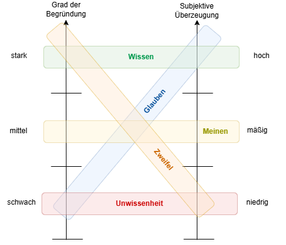

### Glauben, Meinen und Wissen

Kant spricht von Glauben, Wissen und Meinen in der "Kritik der reinen Vernunft", und zwar im Abschnitt über den Modus des Fürwahrhaltens. Genauer ist das Thema im ersten Teil der Transzendentalen Methodenlehre unter der Überschrift:

"Vom Unterschied des Meinen, Wissens und Glaubens"
Die genaue Stelle befindet sich in der B-Ausgabe der Kritik der reinen Vernunft (1787), B 848–B 857 (entspricht den Seiten 848 bis 857 in der paginierten Akademie-Ausgabe). Dort geht Kant auf die Unterschiede zwischen diesen drei Formen des Fürwahrhaltens ein:

Meinen: Ein subjektiv hinreichendes, aber objektiv unzureichendes Fürwahrhalten.
Wissen: Ein sowohl subjektiv als auch objektiv hinreichendes Fürwahrhalten, das Beweise und Gewissheit verlangt.
Glauben: Ein subjektiv hinreichendes Fürwahrhalten, das jedoch objektiv unzureichend ist.
Kontext:
Kant unterscheidet in diesem Abschnitt zwischen der subjektiven Überzeugung, die für eine Person gilt, und der objektiven Gültigkeit, die überpersönlich und allgemein nachvollziehbar sein muss.

