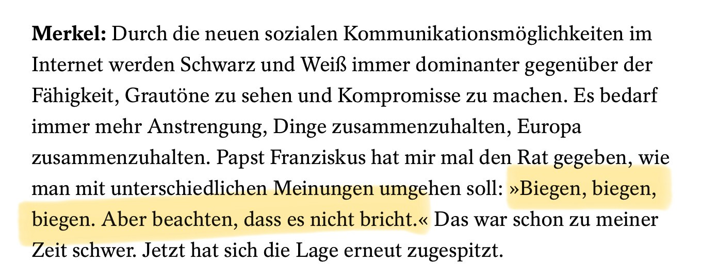

Das Zitat von Ernst Jandl, das Sie anführen, könnte tatsächlich inhaltlich gut mit der Aussage von Papst Franziskus in Verbindung gebracht werden. Beide Texte spielen mit der Spannung zwischen Flexibilität ("biegen") und der Gefahr des Zerbrechens ("brechen"). Während Jandl dies in einem persönlichen, existenziellen Kontext poetisch verarbeitet, greift Franziskus dieselbe Metapher auf, um eine Haltung in Konflikten zu beschreiben.

### **Parallelen**
1. **Biegen statt Brechen:** Beide Texte betonen die Präferenz für das "Biegen" als Ausdruck von Anpassung, Nachgiebigkeit oder Rettung vor Zerstörung. In Jandls Werk ist das "Biegen" ein Akt des Schutzes, während das "Brechen" mit Gewalt und Endgültigkeit assoziiert wird.
   
2. **Spannung zwischen Autorität und Verletzlichkeit:** Jandl setzt dies in einen familiären oder hierarchischen Kontext („liebervater“), während Franziskus auf gesellschaftliche und zwischenmenschliche Dynamiken verweist.

3. **Bitte um Balance:** Jandls Vers spricht eine Art Hilferuf aus – lieber die leichtere Last des Biegens als die endgültige Zerstörung durch das Brechen. Ähnlich ruft Franziskus zur Vorsicht auf, um eine Gesellschaft oder ein Gefüge nicht zu gefährden.

### **Unterschiede**
Jandls Text ist radikal subjektiv und emotional, während Papst Franziskus' Rat auf eine pragmatische und universale Ebene zielt, insbesondere im Umgang mit Meinungsverschiedenheiten.

Es bleibt zwar offen, ob Franziskus Jandl tatsächlich kennt, aber die Überschneidungen in der Metaphorik und der Botschaft sind faszinierend und könnten durchaus als literarische Brücke zwischen beiden Positionen interpretiert werden.