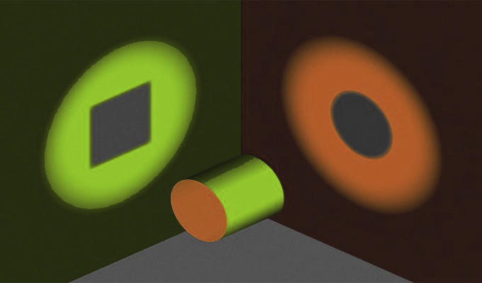

Viewpoint Flattening:
From one angle, the shape is a circle. From another, it’s a square. People on either side argue over the true shape, each convinced that the other is wrong, because social media rewards us for arguing in 2D about 3D issues.

