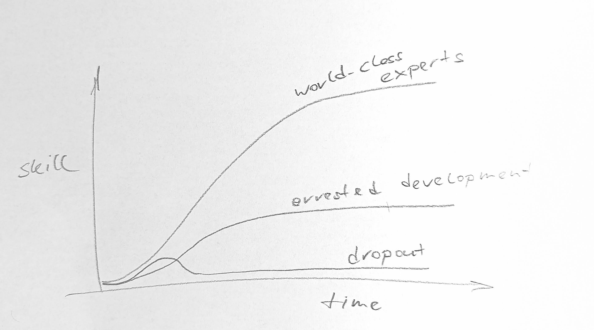

# Kaizen - Continuous Improvement

tbc

from the book GRIT:
```
Kaizen is Japanese for resisting the plateau of arrested development. Its literal translation is: “continuous improvement.” A while back, the idea got some traction in American business culture when it was touted as the core principle behind Japan’s spectacularly efficient manufacturing economy.
```



```
In her interviews with “mega successful” people, journalist Hester
Lacey has noticed that all of them demonstrate a striking desire to excel beyond
their already remarkable level of expertise: “An actor might say, ‘I may never
play a role perfectly, but I want to do it as well as I possibly can. And in every
role, I want to bring something new. I want to develop.’ A writer might say, ‘I
want every book I do to be better than the last.’
“It’s a persistent desire to do better,” Hester explained. “It’s the opposite of
being complacent. But it’s a positive state of mind, not a negative one. It’s not
looking backward with dissatisfaction. It’s looking forward and wanting to
grow.”
```

